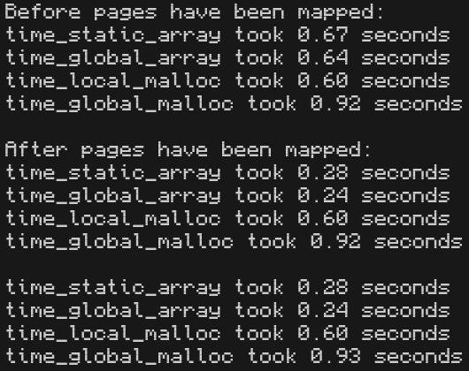

# Static array vs malloc() profiling

This repository has been created to support my blog post titled [Static arrays are the best vectors](https://mynameistrez.github.io/2024/04/09/static-arrays-are-the-best-vectors.html).

`main.c` contains tests that show that growing static or global arrays is pretty much just as fast as growing a local or global `malloc()`ed array:



## Running

You can try the program on godbolt [here](https://godbolt.org/#z:OYLghAFBqd5QCxAYwPYBMCmBRdBLAF1QCcAaPECAMzwBtMA7AQwFtMQByARg9KtQYEAysib0QXACx8BBAKoBnTAAUAHpwAMvAFYTStJg1AB9U8lJL6yAngGVG6AMKpaAVxYM9DgDJ4GmADl3ACNMYgkNaQAHVAVCWwZnNw89GLibAV9/IJZQ8K5Ii0wrDIYhAiZiAiT3Ty4ikoTyyoIswJCwiOkFCqqalPqelracvK6ASgtUV2Jkdg4AegWAaiEXYoBPZYVUbYJXKLx0ZYA1IWXnLGXRBmWaBmOAUgAmZ8dvAHlHAGljZQAlL7YIRCYyOZRyAAqAEkALLYYzQgAiL2ejw0AEEXgBmLD3TDLP4fITQgAaYOMQg%2Bcn%2Bjmwyy4AE5GdiNIzvOisZicX5kG4ro9sY4evhUAA6BCC7CcnkMPmuAVCkW0PDBCVSmXPbG8/kEwWOGxsdXY6Xc7lavF%2BAkkgBa9IAbIyNM6XcslstHctYQAhGWY5AISrLYC0VDBMTGSrEJgbR4AVm9tulcZR2N9/sDxGWACoQ2GI1ECMRBemMXEAF6YYwEZboWTGVCFvAsPCVyMAdxjJb9ZYqNmQtemwXowcwBGMxSYUSU6GMSjQDwUEB6xFc1mWhswCiimAHQyqpD2q/Xm%2B3u%2BWDnGy0eAHZS%2BjGcQxzNbhA665h5hxhAHGKCAA3OdzwAWj2Fo/0A%2Bcrxeb0GTFDRMGAxkc2WN8h3ob9fwA4wGHnZZQP3AgIJwqDu25G8UTNXsmH7ZZ/1QI4N2bKshn7SNiGjDYIHoo5oLvP1GVYvABwDIMhOQdjiwTJN41Te8zUEos1xrU8dz3XoCDIrlGT5VBkAAa2MYAx03CB3i%2BX4ASBEEwQhGF4URJFDxee1CPGLSBP4LNl1bKsazwa9sSRZYNBLZYAv1VZoTtMK8BgmC%2BPkxkH3EyT429OKU0C4K4rTATb0orltJXZSmLYM8BwcDy2V0gyjJM5izM%2BH4/kBOkbPBKE4QRZFnOee1L2q7SvNQis/PC7KQtiwLHCimK03C%2BLnm9RL8rZOtBAbJsWzbJhOy2eKgrAtio3SzK5PyiiewfKJiD8AgqAgVFNznPthMkmMN1QVB9OvZ44zFZ4qG2XcBHQBR40cBhUUPYzx0nadMFnecwaXQjD0vdy8vIwrOXEuiGOOF683DWgPq4nj0FWhSSpPZiKrAqpqp00M6rh0zzJaqz2tBTr7J6py/tcjSsfk4aSFG3zqwmwVgtChaIqFObpQVpaVuvfiFIfEmIyjLsE3OybcqSgrrrZWmVPptSLweZnasM9nGs5yy2uBXm7O6xy%2BoGh5RbNxlbvux7nuYozQ1J8mvp%2Bv6AaBkGF3ByHodeWGxwnAxEeR0HF2XDSMd9v2cZ7fHKbKqtWYjFgxFZ7jCep7TRKzbMK7Jwss1l5Yq9oGuk0LoqUqUunyutwi7dZh2GrYJqLNa6z3a6hzeqFtyhofEafLbfzJvl2DFdmmTVeWhKNZNtkW%2BMNuztko3mdNqiB%2BPS3h/PKrsYb8f6oIDnmpdufbIXgW3tBpv08k%2BTAEBz5tz7gJQOghg6vBeufLurMo6/ReLHYGKNFxJxhqOeGGcZxAQTmjPONsqbQKulREuhMy5h3zGTZBela68RPgJHWrciyTUYcgCAvdV7m0Hk/LcI8NJjz0hPL%2BTsf6zx5v/fmXtl4i34YydeY1paKzltNSKB9d5q3rg%2BbW4cCxFivllDuxtLq4xpoIsuDNX5JXtp/b%2BM9uZuzkZ7JeLlgFizXmA6ARiOHEGgQpWBD0noINDuw4w3DUEx0Bpg7Oic4xQ1wXDdOU5CFYPBrnFo%2BdyEeUoUVe6ncmB%2BGYVTVhIS7pwPCctTAXkCRRCYMZBQyxAz/gJKERgJSog7nQCAHBrxgmMheqlPWXFhnEwCeTCAkzQ5IOrkwuZbA6ER24bM5RoT4FomSQwDEVACBhGWE0lpbSmAdOWF024VdelIwGbs1EwzVFSy3h3HeMslZokPr6Za%2Bi2QPlGW9CS4yNkgP%2BWyKZ9CZnDIBfMvSldFk8JhRCyJ0z1nIoDtUsJqJBnPBhYUu%2BGIOCTFoJwOMvBPDcF4KgTgs0dgzDmH9bEPBSAEE0MSyY%2BkQDYhvIDDQ9oAAcjI4zYmxIyAVGhnhSDjPoTgkgKXstIDSjgvAFAgA0Ky9lkw4CwCQJgVQu5XBEDIBQCAlRgAKGUIYYoQgECoHbJSllaAWCHAMKUK1/haC2vtZSrQpBnWus6MgC1zBpx2oIP61ALq6BhACKweYvAA0xuIB8I13qHWKv1buDExALWcF4Fm5A5R8CUt4PwQQIgxDsCkDIQQigVDqA4H63Q9QDBGBAKYYw5gVTBDVZASYjZShqo4MBAA6tXfCo79VFiYJOsIxAJZjr6YYWiY6qA0TEMBedJBWnAQ%2BOuno%2BEq6zElEFZgNgOnUo6RxI4W54CTFXIIZikJvq0D7bMqYDLq0WAICWj1Nq7UZqpaQds0YoicB4CSslCqm3Us4NgA1yAjUS1UAK%2B0wF7SSGDMgAcEAlIMH0leMyh5cCEAljiLg4xeBstg%2BMSYCBMBMCwOED9XLniSDFJIAVUg2SMntM8ZkgqRWyo4PK0gvq4MqosOqzVtHSA6sQCgKNgaTWUCTfQcIwaFChoUOGvgdBDnEDVRAYIirgh%2BEqBsCDvBzPMGIBsD4wRtC7ho06qNbBBAfAYLQKzsHSBYGCK4YAjhq7DpZVgKuRhxB%2BfwE%2BaweAOnDr9YWo18wWX3WKIqnt0Z7OXHmH6oszZrOkGvcEWImAkSYEiyGPwoA5NUAMBak4eBMDtg%2BDuR1ZbZCVvEDW8t8glBqEVS2/QhgTBmH0Kqd9A6mwCGHWOidY7p3RjnRxRdo7l1PoHGujdtAt1raM/hfdTBD3AWPQGWW56EuYCvfO2902GguYSPYB4/Q6ikB8FaUYnR6hpHiAIN7qRYj/YYCMDo%2BRHvxYEM0PoLhah6EsE96HGkwe5B%2Bz%2BlogPBgo6%2B%2BDiQkx6WzGrVBjg5LxOKuVcsVD6HMPYdw/hwjqFSPGqZZR6jWrOXcoFWKZlXBHSSEdDeZ4zpxXSFJaJmDfrlWqpkzRrQdGRPPEl5J9ntHJjXriHYSQQA), though note that due to godbolt's memory restrictions, the `#define SIZE` has been set to 69 MB. This is fine however, as we get the same result with such a small size.

You can reproduce this repository's screenshot where `SIZE` was set to 1 GB by running this:

```bash
gcc main.c -Wall -Wextra -Werror -Wpedantic -Wfatal-errors -Ofast -march=native && ./a.out
```
